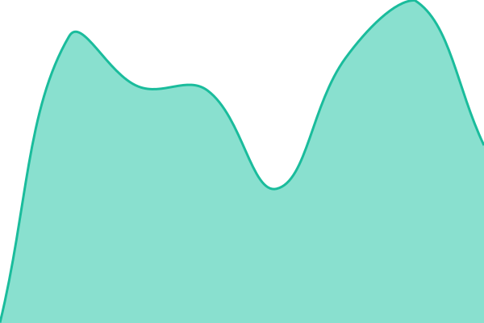

# [📈 Live Status](https://status.zentaraafrica.co.ke): <!--live status--> **🟧 Partial outage**

This repository contains the open-source uptime monitor and status page for [Munyao Nicholas](https://zentaratechnologies.netlify.app/), powered by [Upptime](https://github.com/upptime/upptime).

With [Upptime](https://upptime.js.org), you can get your own unlimited and free uptime monitor and status page, powered entirely by a GitHub repository. We use [Issues](https://github.com/MunyaoN/zentara-status/issues) as incident reports, [Actions](https://github.com/MunyaoN/zentara-status/actions) as uptime monitors, and [Pages](https://status.zentaraafrica.co.ke) for the status page.

<!--start: status pages-->
<!-- This summary is generated by Upptime (https://github.com/upptime/upptime) -->
<!-- Do not edit this manually, your changes will be overwritten -->
<!-- prettier-ignore -->
| URL | Status | History | Response Time | Uptime |
| --- | ------ | ------- | ------------- | ------ |
|  [Zentara Technologies Africa (Website)](https://www.zentaraafrica.co.ke) | 🟩 Up | [zentara-technologies-africa-website.yml](https://github.com/MunyaoN/zentara-status/commits/HEAD/history/zentara-technologies-africa-website.yml) | 

 723ms
     
 | 

<a href="https://status.zentaraafrica.co.ke/history/zentara-technologies-africa-website">100.00%</a>
    

|  [JijiSmart](https://jijismart.zentaraafrica.co.ke) | 🟥 Down | [jiji-smart.yml](https://github.com/MunyaoN/zentara-status/commits/HEAD/history/jiji-smart.yml) | 

 0ms
     
 | 

<a href="https://status.zentaraafrica.co.ke/history/jiji-smart">0.03%</a>
    

|  [WebPos](https://webpos.zentaraafrica.co.ke) | 🟥 Down | [web-pos.yml](https://github.com/MunyaoN/zentara-status/commits/HEAD/history/web-pos.yml) | 

 0ms
     
 | 

<a href="https://status.zentaraafrica.co.ke/history/web-pos">0.03%</a>
    

|  [Zentara E-Soko](https://esoko.zentaraafrica.co.ke) | 🟥 Down | [zentara-e-soko.yml](https://github.com/MunyaoN/zentara-status/commits/HEAD/history/zentara-e-soko.yml) | 

 0ms
     
 | 

<a href="https://status.zentaraafrica.co.ke/history/zentara-e-soko">0.03%</a>
    

|  [MwanaCare](https://mwanacare.zentaraafrica.co.ke) | 🟥 Down | [mwana-care.yml](https://github.com/MunyaoN/zentara-status/commits/HEAD/history/mwana-care.yml) | 

 0ms
     
 | 

<a href="https://status.zentaraafrica.co.ke/history/mwana-care">0.03%</a>
    

|  [MedCore](https://health.zentaraafrica.co.ke) | 🟩 Up | [med-core.yml](https://github.com/MunyaoN/zentara-status/commits/HEAD/history/med-core.yml) | 

 388ms
     
 | 

<a href="https://status.zentaraafrica.co.ke/history/med-core">0.22%</a>
    

|  [TimetablePro](https://timetable.zentaraafrica.co.ke) | 🟥 Down | [timetable-pro.yml](https://github.com/MunyaoN/zentara-status/commits/HEAD/history/timetable-pro.yml) | 

 0ms
     
 | 

<a href="https://status.zentaraafrica.co.ke/history/timetable-pro">0.03%</a>
    

|  [GasFlow](https://gasflow.zentaraafrica.co.ke) | 🟥 Down | [gas-flow.yml](https://github.com/MunyaoN/zentara-status/commits/HEAD/history/gas-flow.yml) | 

 0ms
     
 | 

<a href="https://status.zentaraafrica.co.ke/history/gas-flow">0.03%</a>
    

|  [PharmCore](https://pharmcode.zentaraafrica.co.ke) | 🟥 Down | [pharm-core.yml](https://github.com/MunyaoN/zentara-status/commits/HEAD/history/pharm-core.yml) | 

 0ms
     
 | 

<a href="https://status.zentaraafrica.co.ke/history/pharm-core">0.03%</a>
    

|  [Boresha Constituency](https://mycoonstitueny.zentaraafrica.co.ke) | 🟥 Down | [boresha-constituency.yml](https://github.com/MunyaoN/zentara-status/commits/HEAD/history/boresha-constituency.yml) | 

 0ms
     
 | 

<a href="https://status.zentaraafrica.co.ke/history/boresha-constituency">0.03%</a>
    

|  [Sheria](https://sheria.zentaraafrica.co.ke) | 🟥 Down | [sheria.yml](https://github.com/MunyaoN/zentara-status/commits/HEAD/history/sheria.yml) | 

 0ms
     
 | 

<a href="https://status.zentaraafrica.co.ke/history/sheria">0.03%</a>
    

|  [Zentara Elimu](https://elimu.zentaraafrica.co.ke) | 🟥 Down | [zentara-elimu.yml](https://github.com/MunyaoN/zentara-status/commits/HEAD/history/zentara-elimu.yml) | 

 0ms
     
 | 

<a href="https://status.zentaraafrica.co.ke/history/zentara-elimu">0.03%</a>
    

|  [Zentara AgroMarket](https://agromarket.zentaraafrica.co.ke) | 🟩 Up | [zentara-agro-market.yml](https://github.com/MunyaoN/zentara-status/commits/HEAD/history/zentara-agro-market.yml) | 

 359ms
     
 | 

<a href="https://status.zentaraafrica.co.ke/history/zentara-agro-market">0.06%</a>
    

|  [Zentara Chama](https://chama.zentaraafrica.co.ke) | 🟥 Down | [zentara-chama.yml](https://github.com/MunyaoN/zentara-status/commits/HEAD/history/zentara-chama.yml) | 

 0ms
     
 | 

<a href="https://status.zentaraafrica.co.ke/history/zentara-chama">0.02%</a>
    

<!--end: status pages-->

[**Visit our status website →**](https://status.zentaraafrica.co.ke)

## 📄 License

- Powered by: [Upptime](https://github.com/upptime/upptime)
- Code: [MIT](./LICENSE) © [Anand Chowdhary](https://anandchowdhary.com)
- Data in the `./history` directory: [Open Database License](https://opendatacommons.org/licenses/odbl/1-0/)
